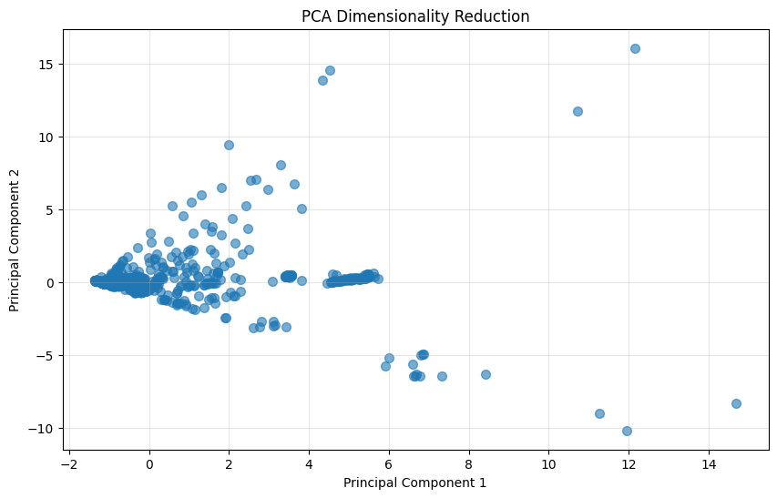
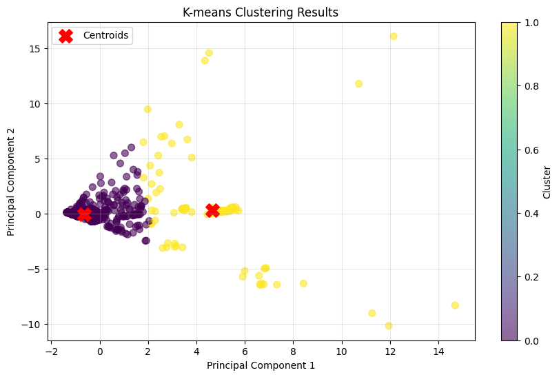
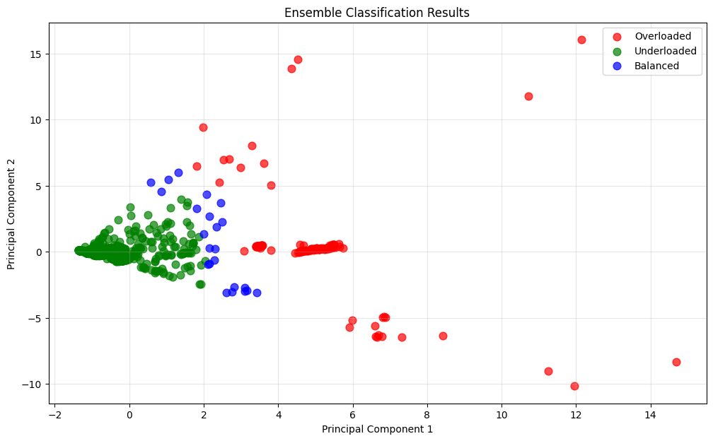

# Container Management for Resource-Constrained IoT Devices

[](https://www.python.org/)
[](https://scikit-learn.org/)

Implementation of an efficient container management scheme using ensemble clustering algorithms and heap data structures for resource-constrained IoT environments.

## Project Overview

This project addresses the challenge of efficient container orchestration in resource-constrained IoT devices by implementing:

- **Ensemble Clustering**: Combining K-means and Hierarchical clustering for robust host classification
- **Dimensionality Reduction**: PCA to reduce feature space while retaining critical variance
- **Heap-Based Management**: Efficient data structures (O(1) access) for container migration decisions

## Objectives

1. Classify virtual machine hosts as **Overloaded**, **Underloaded**, or **Balanced**
2. Apply PCA for efficient dimensionality reduction
3. Implement heap structures for optimized container management
4. Demonstrate container migration using heap operations

## Dataset

**Bitbrains Dataset** - Real-world VM workload traces
- **Source**: [Kaggle - GWA Bitbrains](https://www.kaggle.com/datasets/gauravdhamane/gwa-bitbrains)
- **Size**: 1,750 virtual machine traces
- **Features**: CPU utilization, memory usage, network I/O, disk I/O, etc.
- **Format**: CSV files with timestamped resource metrics

## 🔬 Methodology

### 1. Data Preprocessing
- Loaded and aggregated 1,750 VM traces
- Extracted mean resource utilization features
- Applied StandardScaler normalization
- Handled missing values using mean imputation

### 2. Dimensionality Reduction (PCA)
- Reduced high-dimensional feature space to 2 principal components
- Captured ~60-70% of total variance
- Enabled efficient visualization and clustering

### 3. Clustering Algorithms

#### K-means Clustering
- Algorithm: K-means with k=2
- Initialization: k-means++
- Metric: Euclidean distance
- Identified two distinct resource utilization patterns

#### Hierarchical Clustering
- Algorithm: Agglomerative clustering
- Linkage: Ward (minimizes variance)
- Distance metric: Euclidean
- Created dendrogram-based host groupings

### 4. Ensemble Voting
- Combined predictions from both algorithms
- Classification logic:
  - Both agree HIGH → **Overloaded**
  - Both agree LOW → **Underloaded**
  - Disagree → **Balanced**

### 5. Heap Construction
- **Max Heap**: Overloaded hosts (root = highest load)
- **Min Heaps**: Underloaded and Balanced hosts
- **Complexity**: O(1) root access, O(log n) insert/delete

### 6. Container Migration
- Extracted most overloaded and least loaded hosts
- Simulated container migration (40% load transfer)
- Updated host states and reinserted into heaps

## Results
```
Total VMs analyzed: 1266
Original features: 11

PCA dimensionality reduction: 11 -> 2
Total variance explained: 52.73%

Final classification:
  Overloaded: 137
  Underloaded: 1106
  Balanced: 23

Heap structures:
  Overloaded (max heap): 137
  Underloaded (min heap): 1106
  Balanced (min heap): 23

```

## Visualizations

### PCA Dimensionality Reduction

*Principal Component Analysis reducing feature space to 2D*

### K-means Clustering

*K-means algorithm identifying two resource utilization clusters*

### Hierarchical Clustering

*Agglomerative hierarchical clustering with Ward linkage*

### Ensemble Classification

*Final host classification using ensemble voting*

## Technologies Used

| Technology | Purpose |
|------------|---------|
| **Python 3.x** | Core programming language |
| **pandas** | Data loading and manipulation |
| **NumPy** | Numerical computations |
| **scikit-learn** | Machine learning algorithms (PCA, K-means, Hierarchical) |
| **matplotlib** | Data visualization |
| **heapq** | Heap data structure implementation |
| **Google Colab** | Development environment |
